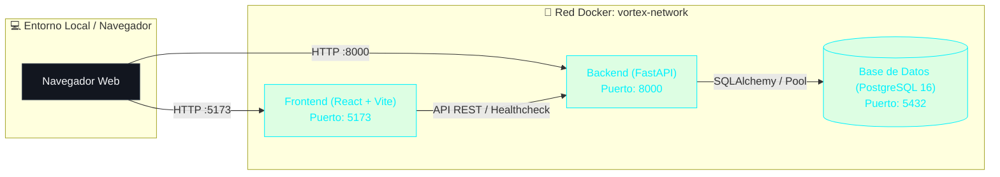

# VORTEX — Shadow Boxing  Exergame

[](#)
[](#)
[](#)
[](#)
[](#)

**VORTEX** es una plataforma web interactiva de entrenamiento físico gamificado (*exergame*) centrada en **Shadow Boxing** asistido por Inteligencia Artificial y visión por computadora. El sistema permite a los usuarios entrenar golpes, combinaciones y reflejos en tiempo real con seguimiento de movimiento, feedback postural y métricas de rendimiento físico.

Este repositorio contiene la arquitectura base monorepo, desacoplada y 100% containerizada mediante **Docker** y **Docker Compose**.

---

## 🏛️ Arquitectura del Sistema

El proyecto opera como un monorepo desacoplado compuesto por tres capas de servicios interconectados a través de una red bridge interna (`vortex-network`):



---

## 📋 Requisitos Previos

Antes de comenzar, asegúrate de tener instaladas las siguientes herramientas en tu sistema operativo:

1. **[Docker Desktop](https://www.docker.com/products/docker-desktop/)** (con Docker Engine >= 24 y Docker Compose v2+).
2. **[Git](https://git-scm.com/)** para clonar el repositorio.

> [!NOTE]
> En Windows, se recomienda habilitar la integración con WSL2 en Docker Desktop para un rendimiento óptimo de I/O en los volúmenes de desarrollo.

---

## 🚀 Guía de Inicio Rápido (Quickstart)

Sigue estos sencillos pasos para poner en marcha toda la infraestructura en cuestión de minutos:

### 1. Clonar el repositorio
```bash
git clone <URL_DEL_REPOSITORIO>
cd VORTEX
```

### 2. Configurar variables de entorno
Copia la plantilla de variables de entorno de ejemplo para crear tu archivo local `.env`:

**En Linux / macOS / Git Bash / PowerShell:**
```bash
cp .env.example .env
```
*(Opcional: puedes personalizar credenciales y puertos dentro de `.env` según tus preferencias).*

### 3. Construir y levantar los contenedores
Ejecuta el siguiente comando en la raíz del proyecto para compilar las imágenes y encender los servicios:

```bash
docker compose up --build
```

Si prefieres ejecutar en segundo plano (modo *detached*):
```bash
docker compose up --build -d
```

### 4. Detener los servicios
Para apagar los contenedores preservando la persistencia de datos:
```bash
docker compose down
```

Para apagar y remover también los volúmenes de base de datos:
```bash
docker compose down -v
```

---

## 🌐 URLs y Servicios Activos

Una vez levantados los servicios, los siguientes puntos de acceso estarán disponibles en tu máquina local:

| Servicio | URL Local | Descripción |
| :--- | :--- | :--- |
| **Frontend** | [http://localhost:5173](http://localhost:5173) | Interfaz gráfica interactiva en React + Vite (Monitor de salud del sistema) |
| **Backend API** | [http://localhost:8000](http://localhost:8000) | Raíz del servicio REST en FastAPI |
| **Health Check API** | [http://localhost:8000/api/health](http://localhost:8000/api/health) | Endpoint JSON de verificación de estado y conexión a BD |
| **Swagger UI** | [http://localhost:8000/docs](http://localhost:8000/docs) | Documentación interactiva OpenAPI/Swagger de FastAPI |
| **ReDoc** | [http://localhost:8000/redoc](http://localhost:8000/redoc) | Documentación alternativa de la API |
| **Base de Datos** | `localhost:5432` | Instancia de PostgreSQL 16 accesible para clientes externos (DBeaver, pgAdmin, etc.) |

---

## 📁 Estructura del Proyecto

```
VORTEX/
├── .env.example             # Plantilla de variables de entorno del proyecto
├── .env                     # Variables de entorno locales (ignorado en git)
├── .gitignore               # Exclusiones de Git para Python, Node, Docker y SO
├── docker-compose.yml       # Orquestador multi-contenedor (db, backend, frontend)
├── README.md                # Documentación del proyecto
│
├── backend/                 # Servicio API REST (Python / FastAPI)
│   ├── database.py          # Configuración de SQLAlchemy y validación de conexión a BD
│   ├── Dockerfile           # Imagen Docker basada en python:3.11-slim
│   ├── .dockerignore        # Exclusiones de compilación de imagen
│   ├── main.py              # Aplicación FastAPI, configuración CORS y ruta /api/health
│   └── requirements.txt     # Dependencias del backend (FastAPI, Uvicorn, SQLAlchemy, psycopg2)
│
├── database/                # Inicialización y esquemas de base de datos
│   └── init.sql             # Script SQL ejecutado automáticamente en el primer arranque de Postgres
│
└── frontend/                # Interfaz de usuario (React / Vite)
    ├── Dockerfile           # Imagen Docker basada en node:20-alpine
    ├── .dockerignore        # Exclusiones de compilación de imagen
    ├── index.html           # Plantilla base HTML con fuentes Outfit & JetBrains Mono
    ├── package.json         # Dependencias y scripts de Node.js
    ├── vite.config.js       # Configuración del servidor Vite (host 0.0.0.0, strictPort, polling)
    └── src/
        ├── App.jsx          # Componente principal con diagnóstico visual y consumo de /api/health
        ├── index.css        # Estilos modernos temáticos oscuros con efectos de resplandor
        └── main.jsx         # Punto de montaje React DOM
```

---

## 🧪 Verificación de Funcionamiento y Health Check

El proyecto implementa un flujo de arranque orquestado con dependencias de salud (`depends_on` con `condition: service_healthy`):

1. **PostgreSQL (`db`)** inicia y ejecuta su healthcheck interno con `pg_isready`. Además, corre el script `database/init.sql`.
2. Una vez saludable la base de datos, inicia **FastAPI (`backend`)**, conecta con PostgreSQL mediante SQLAlchemy y expone el endpoint `/api/health`.
3. Una vez saludable el backend, inicia **Vite (`frontend`)** y al cargar en el navegador realiza un `fetch()` automático al endpoint `/api/health`.
4. Si la cadena está operativa, la interfaz muestra el banner verde: **"Sistema listo y conectado"**.

### Prueba directa vía consola (cURL):
```bash
curl -s http://localhost:8000/api/health
```

Respuesta esperada:
```json
{
  "status": "ok",
  "db_connected": true,
  "message": "Backend y BD conectados correctamente"
}
```

---

## 👥 Guía para el Equipo de Desarrollo

- **Modificaciones en Backend:** Los cambios en archivos `.py` dentro de `/backend` se reflejan en tiempo real gracias al flag `--reload` de Uvicorn y al volumen montado.
- **Modificaciones en Frontend:** Vite detecta cambios en tiempo real en `/frontend/src` mediante `usePolling: true`.
- **Nuevas librerías:** 
  - En backend: agregar al `requirements.txt` y reconstruir el contenedor (`docker compose build backend`).
  - En frontend: agregar al `package.json` y reconstruir el contenedor (`docker compose build frontend`).
